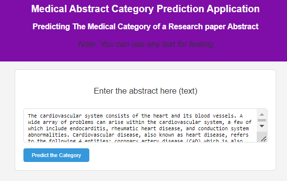
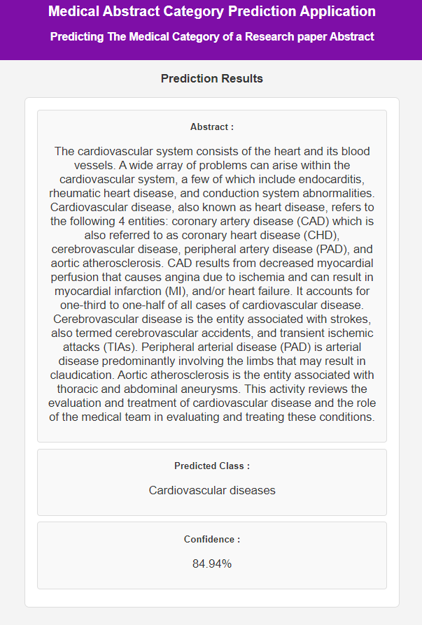
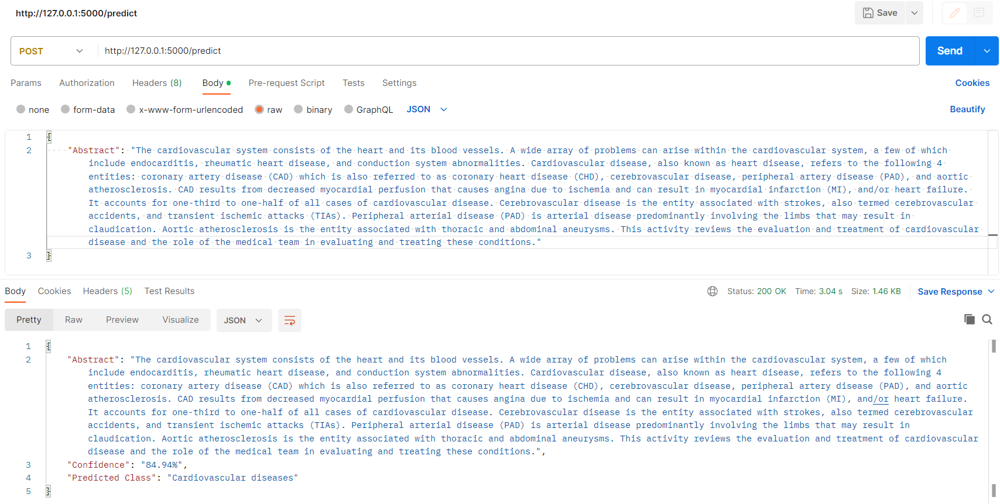

# Medical Abstract Category Prediction App

This application utilizes Flask as its REST API framework, providing a robust and efficient platform for predicting medical abstract categories. Flask, a micro web framework in Python, facilitates the development of web applications with ease and flexibility. To test the functionality of the application, you can use either a web browser or Postman.

# Project Structure

The solution for this written test is organized into the following folders:

- **data:** Contains data files downloaded from the provided public source.
- **templates:** Includes template files for the HTML presentation of the app.
- **models:** Holds saved models after training. This is where the trained models are stored for future use. you can download the model used for testing the app from this [Link to Drive](https://drive.google.com/file/d/17v5eVYjpgZIujjI5jTsJOIKXdzlvJ05g/view?usp=sharing), it is larger that 100mb to be uploded in github. Then place it under models/ and rename the path in app.py. I add a low performence model under models folder as a proof of concept only.
- **notebooks:** Three notebooks used to train different algorithms. If you want to regenerate the notebooks, please install the required dependencies specified in [notebooks_requirements.txt](notebooks_requirements.txt).
- **app.py:** The main Flask application file responsible for running the app.
- **requirements.txt:** Lists the dependencies required to run and test the app. Install these dependencies using `pip install -r requirements.txt`.

## Technologies

The project utilizes the following technologies, and a complete list of requirements can be found in the `requirements.txt` file:

- **Python 3.8.9:** The programming language used for model development, application logic, and various scripting tasks.
- **Flask:** A micro web framework for Python, employed to create the REST API and develop the web application. Flask facilitates efficient development and deployment of web-based solutions.

These technologies form the foundation of this solution, ensuring a robust and scalable framework for the implementation of both machine learning models and the accompanying web application.

## Notebooks

To regenerate the notebooks, install the necessary dependencies from [notebooks_requirements.txt](notebooks_requirements.txt).

We experimented with various machine learning models for text classification, and while the accuracy achieved is not optimal, it serves as a proof of concept. Due to time limitations, further training is needed to improve the results. Additional deep learning models, including RNN training and BERT fine-tuning, have been initiated in separate notebooks as part of ongoing efforts to enhance performance. The trained models from these notebooks are not currently used in the hosted application. They are intended as a demonstration of potential improvements and serve as a foundation for future iterations.

## Running the App

To run the Flask application, execute `python app.py` in the terminal after installing the dependencies from [requirements.txt](./requirements.txt).

## Testing the App

### Using a Web Browser

Simply open your preferred web browser (such as Chrome, Firefox, or Safari) and navigate to the application's URL. The browser provides a user-friendly interface for entering data and observing predictions.





### Using Postman

Postman is a powerful API testing tool that allows you to make HTTP requests, inspect responses, and validate the functionality of the API endpoints. To test the app with Postman, follow these steps:

1. Install Postman from [https://www.postman.com/](https://www.postman.com/).
2. Open Postman and create a new request.
3. Enter the app's API endpoint URL and specify the necessary parameters.
4. Send the request and analyze the response to evaluate the application's performance.



These testing tools, whether using a browser for a straightforward user experience or Postman for in-depth API testing, contribute to a thorough evaluation of the application's capabilities.

## Data

This project uses the [Medical Abstracts TC Corpus](https://paperswithcode.com/dataset/medical-abstracts) a dataset with medical abstracts categorized into 5 classes, including Neoplasms, Digestive System Diseases, Nervous System Diseases, Cardiovascular Diseases, and General Pathological Conditions. The classification model in this project predicts abstract categories. The mapping of class labels to their corresponding categories is defined as follows:

```python
categories_map = {
    1: "Neoplasms",
    2: "Digestive system diseases",
    3: "Nervous system diseases",
    4: "Cardiovascular diseases",
    5: "General pathological conditions",
}
```

NOTE: *The selection of the medical abstracts dataset for this project was  random. We chose a less-known dataset because we wanted to deal with real-world challenges that aren't easily solved on popular platforms like Kaggle. This choice shows that our code is original and tailored to the specific data we chose. The dataset encompasses a diverse range of patient conditions, with a suitable distribution across 5 to 10 classes, ensuring a robust and challenging environment for model training and evaluation. This is a reasonably-sized dataset, comprising approximately 11,000 instances, strikes a balance between complexity and feasibility in this exploratory phase of the project.*


# Conclusion

The MultiClassClassificationApp is a sophisticated application that leverages Machine Learning (ML) and Deep Learning (DL) techniques for multi-class classification tasks. Built on a Flask framework, this application serves as a Restful API, providing seamless integration and accessibility.

Key Features:

1. **ML and DL Integration:**

   * The app incorporates both traditional Machine Learning algorithms and advanced Deep Learning models to handle multi-class classification tasks efficiently.
2. **RESTful API Design:**

   * The application is designed as a RESTful API, allowing users to interact with it easily. This design enables straightforward integration with various platforms and applications. Hosted on the Flask web framework, the application ensures scalability and responsiveness, making it suitable for a variety of use cases.
3. **User-Friendly Interface:**

   * The app provides a user-friendly interface for interacting with the classification models. Users can submit data for classification through simple API calls.
4. **Model Deployment:**

   * Selected ML model is deployed seamlessly using Flask, allowing users to make predictions by sending requests to the API. This deployment setup ensures real-time predictions and efficient utilization of the model.
5. **Documentation and Support:**

   * Comprehensive documentation is provided, offering guidance on API usage, model integration, and customization.
6. **Continuous Improvement:**

   * The MultiClassClassificationApp is basic, simple and fast coded solution for the given task, diffrent improvements can be made tp increase the models performas further mentioned in the notebooks.

Overall, the MultiClassClassificationApp is a solution for multi-class classification task and easily accessible through a Flask-based RESTful API.
